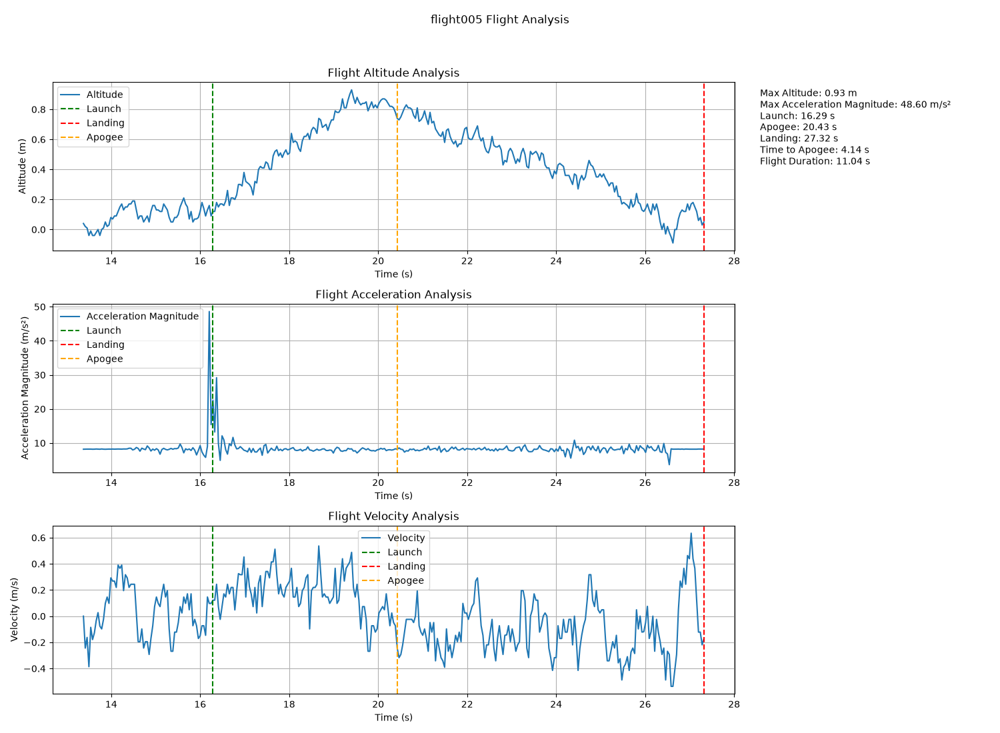

# Teensy 4.1 Flight Computer



Embedded avionics system for hobby rockets, built around a Teensy 4.1 microcontroller.  Features onboard telemetry recording, key flight event detection with the use of a finite state machine, and data logging to a microSD card with which an included Python script can run post-flight analysis.

## Overview

This project began as a way to explore embedded systems, hardware interfacing, finite state machines, and a general interest in avionics with flight analysis.
The flight computer continuously measures atmospheric pressure using a BMP 390 barometric pressure sensor and then estimates altitude throughout the flight.  Using this data, a finite state machine detects launch, apogee, descent, and landing.  Telemetry is recorded to a microSD card.
After flight, a Python analysis script can load the recorded telemetry, identify flight events, estimate velocity** from altitude data, and generates a plotted flight report graph with summary stats.

## Features

- Real-time altitude estimation using the BMP390
- Finite state machine for flight detection
- Automatic launch detection
- Automatic apogee detection
- Automatic landing detection
- Telemetry logging to microSD
- CSV flight log generation
- Python post-flight analysis
- Automatic report generation
- Velocity estimation from altitude data
- Event markers for launch, apogee, and landing

**Note:** The current method for estimating velocity is to differentiate smoothed barometric altitude data.  Because of inherent noise from the barometric measurements, velocity estimation is still being refined for possible future revisions.  Possible solutions are introducing a Kalman filter or a BNO085 for acceleration readings

## Hardware

### Components

| Component | Purpose |
|----------|---------|
| Teensy 4.1 | Main flight computer and data logger |
| BMP390 Barometric Pressure Sensor | Measures atmospheric pressure for altitude estimation |
| microSD Card | Stores flight telemetry logs |
| Breadboard | Rapid prototyping |
| Jumper Wires | Sensor connections |
| USB-C | Programming and serial communication |

### Sensor Connections

| BMP390 | Teensy 4.1 |
|--------|------------|
| VIN | 3.3V |
| GND | GND |
| SDA | SDA |
| SCL | SCL |

> **Images coming soon.** Future updates will include hardware photos and a wiring diagram.

## Software Architecture

Consists of two major components

### Embedded Firmware

The Teensy firmware handles:

- Reading BMP390 sensor data
- Calculating altitude from atmospheric pressure
- Detecting launch, apogee, and landing using a finite state machine
- Logging telemetry to a microSD card

### Python Analysis Tool

The Python Script is able to:

- Load recorded flight logs
- Allow the user to select any recorded flight
- Detect key flight events
- Estimate velocity from smoothed altitude data
- Generate a multi-plot flight report with summary statistics


## Repository Structure

```
FlightComputer
│
├── Arduino/
├── Documentation/
├── FlightLogs/
├── Images/
├── Python/
├── README.md
└── .gitignore
```

## Example Output

The figure below is automatically generated by the Python analysis tool after processing a recorded flight log.


## Future Improvements

- Integrate a BNO085 IMU for improved motion sensing
- Implement a Kalman filter for sensor fusion and more accurate velocity estimation
- Add GPS for position tracking
- Support wireless telemetry to a ground station
- Add parachute deployment outputs
- Design and manufacture a custom PCB


## Lessons Learned

Through this project I gained hands-on experience with:

- Embedded systems development
- I2C sensor communication
- Finite state machine design
- Telemetry logging to removable storage
- Python data analysis
- Signal smoothing techniques
- Engineering data visualization using Matplotlib
- Software organization and modular design
- Git and GitHub version control